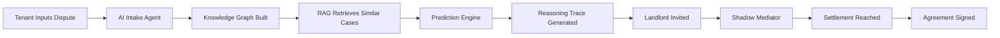

# Proposer 🏠⚖️

**AI-Powered Mediation for UK Tenancy Deposit Disputes**

[](https://opensource.org/licenses/MIT)
[](https://www.python.org/downloads/)
[](https://www.typescriptlang.org/)
[](CONTRIBUTING.md)

> **Bridging the justice gap**: Proposer uses hybrid RAG + Knowledge Graph architecture to predict tribunal outcomes and facilitate fair settlements—no lawyers required.

---

## 📖 Table of Contents

- [The Problem](#-the-problem)
- [Our Solution](#-our-solution)
- [How It Works](#-how-it-works)
- [Tech Stack](#-tech-stack)
- [Getting Started](#-getting-started)
- [Project Structure](#-project-structure)
- [Development](#-development)
- [Evaluation](#-evaluation)
- [Roadmap](#-roadmap)
- [Contributing](#-contributing)
- [License](#-license)
- [Changelog](#changelog) <!-- Added to Table of Contents -->

---

## 🎯 The Problem

Every year, **millions of tenants in the UK** dispute deposit deductions with their landlords. The current system is broken:

- 📉 **Justice Gap**: 70% of tenants can't afford solicitors for £500-2000 deposit disputes
- ⏰ **12-Month Delays**: First-tier Tribunal cases take an average of a year to resolve
- 🎭 **Information Asymmetry**: Landlords often have legal knowledge/resources that tenants lack
- 🤝 **Mediation Failure**: Traditional mediation is a "black box"—parties have no idea what a fair outcome looks like

**Result**: Tenants either accept unfair deductions or face costly, lengthy tribunal battles.

---

## 💡 Our Solution

**Proposer** is an **outcome-driven mediation platform** that changes the game:

### Instead of "Let's talk about feelings"...
We say: **"Here's what the law says, based on what tribunals say"**

### Key Innovations

1. **🔍 Glass-Box Reasoning**: Every prediction is backed by cited case law—no black boxes
2. **📊 Predictive Analytics**: "In 87% of similar cases, the tenant recovered £850"
3. **🤖 Rational Mediation**: Uses predicted tribunal outcome to anchor negotiations
4. **⚡ Speed**: Get a data-backed settlement in hours, not months

### What Makes Us Different

| Feature | Traditional Mediation | Legal Chatbots | **Proposer** |
|---------|----------------------|----------------|--------------|
| **Data Source** | Mediator's intuition | Generic legal info | 500+ tribunal precedents |
| **Transparency** | Opaque | Vague | **Every claim cited** |
| **Goal** | Any agreement | User engagement | **Fair outcome aligned with law** |
| **Method** | Facilitative | Information retrieval | **Evaluative + predictive** |

---

## 🔧 How It Works

### The User Journey



### 1️⃣ **Intelligent Intake**
Instead of static forms, an AI agent asks dynamic questions:
- "You mentioned mold. Did you report this in writing?"
- "Do you have photos from move-in day?"

### 2️⃣ **Hybrid Analysis**
Our system combines two AI approaches:

**Knowledge Graph (KG)**: Structured facts
- Nodes: Parties, Evidence, Issues, Claims
- Edges: "Evidence supports claim", "Event occurred before tenancy end"
- Ensures logical consistency

**Retrieval-Augmented Generation (RAG)**: Legal precedent
- Searches 500+ First-tier Tribunal decisions
- Finds cases with similar fact patterns
- Semantic search + re-ranking for relevance

### 3️⃣ **Transparent Prediction**
The system generates a **Reasoning Trace**:
- ✅ Key issues identified
- 📄 Relevant evidence from your case
- ⚖️ Analogous precedent cases (cited)
- 🎯 Predicted outcome with confidence score
- ❓ Missing information that could change the outcome

**Example Output**:
> "Based on 8 similar cases where landlords claimed carpet damage without check-in inventory, tenants recovered an average of £780 (85% confidence). Key precedent: *Smith v. Jones Properties, 2022* where tribunal ruled landlords cannot prove pre-existing damage without baseline evidence."

### 4️⃣ **Shadow Mediation**
An AI mediator monitors negotiations in real-time:
- Calculates **ZOPA** (Zone of Possible Agreement)
- Interjects when offers are unrealistic
- Suggests fair settlement packages

**Example Nudge**:
> "⚠️ Note: In 92% of similar cases where no check-in inventory exists, the landlord loses the full claim. Current offer (£200 refund) is below the predicted range (£700-900)."

---

## 🛠️ Tech Stack

### Backend
- **FastAPI** (Python 3.11+): Async API with type safety
- **Langfuse**: LLM observability and tracing (no LangChain; native async orchestration via FastAPI, asyncio, and aiohttp)
- **ChromaDB**: Vector embeddings for RAG retrieval
- **Neo4j Community**: Knowledge graph for dispute facts
- **PostgreSQL**: User accounts, case metadata, audit logs

### Frontend
- **Next.js 16** (App Router): React framework with SSR
- **TypeScript**: Type-safe development
- **shadcn/ui** + **Tailwind CSS**: Modern UI components
- **Supabase Auth**: User authentication

### AI/ML
- **Primary LLM**: Claude 3.5 Sonnet (best reasoning)
- **Fallback LLM**: GPT-4 Turbo
- **Embeddings**: text-embedding-3-small (OpenAI)
- **Frameworks**: LangChain, LangSmith (tracing)

### Infrastructure
- **Hosting**: Railway and Cloudlfare for Web Hosting
- **Monitoring**: Sentry (errors), PostHog (analytics)
- **CI/CD**: GitHub Actions
- **Package Manager**: npm workspaces (monorepo)

---

## 🚀 Getting Started

### Prerequisites

- **Node.js** 18+ and **npm** 9+
- **Python** 3.14+
- **PostgreSQL** 14+
- **Docker** (for Neo4j and ChromaDB)
- **API Keys**: Anthropic (Claude)

### Installation

```bash
# Clone the repository
git clone https://github.com/yourusername/proposer.git
cd proposer

# Install dependencies
npm install

# Set up Python environment
cd apps/api
python -m venv venv
source venv/bin/activate  # On Windows: venv\Scripts\activate
pip install -r requirements.txt

# Set up environment variables
cp .env.example .env
# Edit .env with your API keys and database URLs

# Start databases (Docker)
docker-compose up -d

# Run database migrations
npm run db:migrate

# Start development servers
npm run dev
```

This will start:
- Frontend: http://localhost:3000
- API: http://localhost:8000
- API Docs: http://localhost:8000/docs

### Quick Test

```bash
# Test BAILII scraper (dry run - lists cases without downloading)
python -m scripts.scrapers.bailii_scraper --dry-run --years 2024

# View scraper statistics
python -m scripts.scrapers.bailii_scraper --stats

# Run the RAG pipeline on a test case
cd apps/api
python -m pytest tests/test_rag.py -v

# Check prediction accuracy on evaluation set
python scripts/evaluate_predictions.py --test-set data/test-cases/gold-standard.json
```

---

## 📁 Project Structure

```
proposer/
├── apps/
│   ├── web/                    # Next.js frontend
│   │   ├── app/                # App Router pages
│   │   ├── components/         # React components
│   │   └── lib/                # Utilities, API client
│   ├── api/                    # FastAPI backend
│   │   ├── src/
│   │   │   ├── routers/        # API endpoints
│   │   │   ├── services/       # Business logic
│   │   │   └── models/         # Database models
│   │   └── tests/              # API tests
│   └── workers/                # Background jobs (scraping, embeddings)
│
├── packages/
│   ├── shared/                 # Shared TypeScript types
│   ├── rag-engine/             # RAG pipeline (Python)
│   ├── kg-builder/             # Knowledge Graph (Python)
│   ├── llm-orchestrator/       # LLM agents (Python)
│   └── legal-db/               # Database schemas
│
├── data/
│   ├── raw/                    # Scraped tribunal decisions
│   │   └── bailii/             # BAILII scraper output
│   │       ├── deposit-cases/  # Deposit dispute cases
│   │       ├── adjacent-cases/ # Related cases (RRO, HMO)
│   │       └── other-cases/    # All other tribunal cases
│   ├── processed/              # Cleaned, structured cases
│   ├── embeddings/             # ChromaDB vector store
│   └── test-cases/             # Evaluation datasets
│
├── scripts/
│   ├── scrapers/               # Data collection scrapers
│   │   ├── bailii_scraper.py   # BAILII tribunal decisions scraper
│   │   ├── config.py           # Keywords and settings
│   │   ├── models.py           # Pydantic data models
│   │   ├── parsers.py          # HTML parsing
│   │   ├── downloader.py       # Async HTTP client
│   │   └── progress.py         # SQLite progress tracking
│   ├── build-embeddings.py     # Generate vector store
│   └── evaluate-predictions.py # Accuracy testing
│
├── docs/
│   ├── architecture.md         # System design
│   ├── api-spec.yaml           # OpenAPI specification
│   └── evaluation-results.md   # Performance metrics
│
├── .cursorrules                # AI assistant context
├── CLAUDE.md                   # Project philosophy & roadmap
├── README.md                   # You are here
├── CHANGELOG.md                # See recent changes <!-- Added link to changelog -->
└── docker-compose.yml          # Local development setup
```

---

## 💻 Development

### Running Tests

```bash
# Frontend tests
cd apps/web
npm test

# Backend tests
cd apps/api
pytest

# Integration tests
npm run test:integration

# Evaluation tests (critical!)
python scripts/evaluate-predictions.py
```

### Key Development Commands

```bash
# Start all services
npm run dev

# Run database migrations
npm run db:migrate

# Scrape new tribunal decisions
python -m scripts.scrapers.bailii_scraper --years 2024
python -m scripts.scrapers.bailii_scraper --year-range 2020-2025
python -m scripts.scrapers.bailii_scraper --resume  # Resume interrupted scrape

# Rebuild embeddings
python scripts/build-embeddings.py --source data/processed

# Type checking
npm run type-check

# Linting
npm run lint

# Format code
npm run format
```

### Coding Standards

See [`.cursorrules`](.cursorrules) for detailed guidelines. Key principles:

1. **Legal Safety First**: Every output must be framed as information, not advice
2. **Cite or Abstain**: Never generate claims without retrieval evidence
3. **Evaluation-Driven**: Measure accuracy, calibration, and fairness
4. **Transparent Reasoning**: Every prediction must include reasoning trace
5. **Type Safety**: Use TypeScript on frontend, Pydantic on backend

---

## 📊 Evaluation

We track multiple metrics to ensure quality:

### Prediction Accuracy
- **Win/Loss Classification**: % correct predictions
- **Amount Prediction**: Mean Absolute Error (MAE)
- **Calibration**: Brier Score, reliability diagrams
- **Target**: >70% accuracy, Brier Score <0.20

### Explanation Quality
- **Citation Accuracy**: % of claims with valid case citations
- **Hallucination Rate**: % of unsupported claims
- **Target**: <2% hallucination rate

### Mediation Efficacy
- **Settlement Rate**: % of cases settled vs. escalated
- **Settlement Fairness**: MAE between suggested settlement and actual tribunal outcome
- **Target**: Settlements within £100 of predicted outcome

### System Performance
- **Response Time**: Median time for full analysis
- **Cost per Case**: LLM API costs per prediction
- **Target**: <30 seconds, <£0.50 per case

See [`docs/evaluation-results.md`](docs/evaluation-results.md) for detailed metrics.

---

## 🤝 Contributing

We welcome contributions! Here's how to get involved:

### Contribution Process

1. **Fork** the repository
2. **Create a branch**: `git checkout -b feature/your-feature-name`
3. **Add tests** for new functionality
4. **Run evaluation**: Ensure no accuracy regression
5. **Submit PR** with clear description

### Code of Conduct

- Be respectful and constructive
- Prioritize user safety and legal compliance
- Document your changes thoroughly
- Focus on improving access to justice

---

## 📄 License

This project is licensed under the **MIT License** - see [LICENSE](LICENSE) for details.

### Important Legal Disclaimer

⚠️ **Proposer is not a law firm and does not provide legal advice.** All outputs are informational only and based on analysis of past tribunal decisions. Users should consult qualified solicitors for legal advice specific to their circumstances.

By using this software, you acknowledge that:
- Predictions are probabilistic and not guaranteed
- Settlement suggestions are for reference only
- The developers assume no liability for outcomes
- This tool does not create an attorney-client relationship

---

## 🙏 Acknowledgments

- **First-tier Tribunal (Property Chamber)** for publishing decisions
- **Housing Ombudsman** for adjudication data
- **Anthropic** for Claude API access
- **Imperial College London** for academic support
- The open-source community for foundational libraries

---

## 📞 Contact

**Mohamed** - Computer Science @ Imperial College London
- Building in public: [TikTok](https://tiktok.com/@mshar1f) | [LinkedIn](https://linkedin.com/in/mohamed-sharif-stemm
- Email: mohamed.sharif22@imperial.ac.uk
- Project Link: [https://github.com/MSH4R1F/proposer](https://github.com/MSH4R1F/proposer)

---

## 📝 Changelog

See [CHANGELOG.md](CHANGELOG.md) for a detailed list of recent updates, features, fixes, and improvements.

**Built with ❤️ to bridge the justice gap, one dispute at a time.**