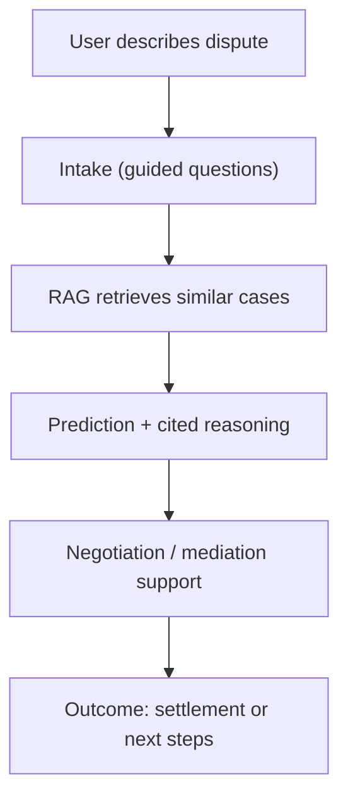
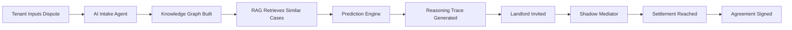
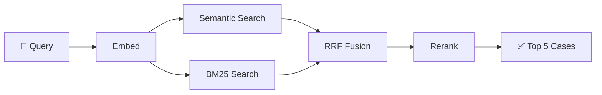

# Proposer 🏠⚖️

**AI-Powered Mediation for UK Tenancy Deposit Disputes**

[](https://opensource.org/licenses/MIT)
[](https://www.python.org/downloads/)
[](https://www.typescriptlang.org/)
[](CONTRIBUTING.md)

> **Bridging the justice gap**: Proposer uses hybrid RAG + Knowledge Graph architecture to predict tribunal outcomes and facilitate fair settlements—no lawyers required.

---

## 📖 Table of Contents

- [The Problem](#-the-problem)
- [Our Solution](#-our-solution)
- [How It Works](#-how-it-works)
- [Tech Stack](#-tech-stack)
- [Getting Started](#-getting-started)
- [Project Structure](#-project-structure)
- [Development](#-development)
- [Evaluation](#-evaluation)
- [Roadmap](#-roadmap)
- [Contributing](#-contributing)
- [License](#-license)
- [Changelog](#changelog) <!-- Added to Table of Contents -->

---

## 🎯 The Problem

Every year, **millions of tenants in the UK** dispute deposit deductions with their landlords. The current system is broken:

- 📉 **Justice Gap**: 70% of tenants can't afford solicitors for £500-2000 deposit disputes
- ⏰ **12-Month Delays**: First-tier Tribunal cases take an average of a year to resolve
- 🎭 **Information Asymmetry**: Landlords often have legal knowledge/resources that tenants lack
- 🤝 **Mediation Failure**: Traditional mediation is a "black box"—parties have no idea what a fair outcome looks like

**Result**: Tenants either accept unfair deductions or face costly, lengthy tribunal battles.

---

## 💡 Our Solution

**Proposer** is an **outcome-driven mediation platform** that changes the game:

### Instead of "Let's talk about feelings"...
We say: **"Here's what the law says, based on what tribunals say"**

### Key Innovations

1. **🔍 Glass-Box Reasoning**: Every prediction is backed by cited case law—no black boxes
2. **📊 Predictive Analytics**: "In 87% of similar cases, the tenant recovered £850"
3. **🤖 Rational Mediation**: Uses predicted tribunal outcome to anchor negotiations
4. **⚡ Speed**: Get a data-backed settlement in hours, not months

### What Makes Us Different

| Feature | Traditional Mediation | Legal Chatbots | **Proposer** |
|---------|----------------------|----------------|--------------|
| **Data Source** | Mediator's intuition | Generic legal info | 500+ tribunal precedents |
| **Transparency** | Opaque | Vague | **Every claim cited** |
| **Goal** | Any agreement | User engagement | **Fair outcome aligned with law** |
| **Method** | Facilitative | Information retrieval | **Evaluative + predictive** |

---

## 🔧 How It Works

### Quick Diagram


```mermaid
flowchart TD
  U["User describes dispute"] --> I["Intake (guided questions)"]
  I --> R["RAG retrieves similar cases"]
  R --> P["Prediction + cited reasoning"]
  P --> N["Negotiation / mediation support"]
  N --> O["Outcome: settlement or next steps"]
```

### The User Journey


```mermaid
graph LR
    A[Tenant Inputs Dispute] --> B[AI Intake Agent]
    B --> C[Knowledge Graph Built]
    C --> D[RAG Retrieves Similar Cases]
    D --> E[Prediction Engine]
    E --> F[Reasoning Trace Generated]
    F --> G[Landlord Invited]
    G --> H[Shadow Mediator]
    H --> I[Settlement Reached]
    I --> J[Agreement Signed]
```

### 1️⃣ **Intelligent Intake**
Instead of static forms, an AI agent asks dynamic questions:
- "You mentioned mold. Did you report this in writing?"
- "Do you have photos from move-in day?"

### 2️⃣ **Hybrid Analysis**
Our system combines two AI approaches:

**Retrieval-Augmented Generation (RAG)** ✅ *Implemented*
- **Hybrid Search**: Combines semantic embeddings (OpenAI) + BM25 keyword search
- **Section-Aware**: Chunks legal documents by Background/Facts/Reasoning/Decision
- **Domain Reranking**: Prioritizes by issue type, recency, region, evidence similarity
- **Uncertainty Detection**: Flags when no similar cases found


```mermaid
flowchart LR
    A["🔎 Query"] --> B["Embed"]
    B --> C["Semantic Search"]
    B --> D["BM25 Search"]
    C --> E["RRF Fusion"]
    D --> E
    E --> F["Rerank"]
    F --> G["✅ Top 5 Cases"]
```

**Knowledge Graph (KG)** 🔜 *Coming Sprint 3-4*
- Nodes: Parties, Evidence, Issues, Claims
- Edges: "Evidence supports claim", "Event occurred before tenancy end"
- Ensures logical consistency

### 3️⃣ **Transparent Prediction**
The system generates a **Reasoning Trace**:
- ✅ Key issues identified
- 📄 Relevant evidence from your case
- ⚖️ Analogous precedent cases (cited)
- 🎯 Predicted outcome with confidence score
- ❓ Missing information that could change the outcome

**Example Output**:
> "Based on 8 similar cases where landlords claimed carpet damage without check-in inventory, tenants recovered an average of £780 (85% confidence). Key precedent: *Smith v. Jones Properties, 2022* where tribunal ruled landlords cannot prove pre-existing damage without baseline evidence."

### 4️⃣ **Shadow Mediation**
An AI mediator monitors negotiations in real-time:
- Calculates **ZOPA** (Zone of Possible Agreement)
- Interjects when offers are unrealistic
- Suggests fair settlement packages

**Example Nudge**:
> "⚠️ Note: In 92% of similar cases where no check-in inventory exists, the landlord loses the full claim. Current offer (£200 refund) is below the predicted range (£700-900)."

---

## 🛠️ Tech Stack

### Backend
- **FastAPI** (Python 3.11+): Async API with type safety
- **Langfuse**: LLM observability and tracing (no LangChain; native async orchestration via FastAPI, asyncio, and aiohttp)
- **ChromaDB**: Vector embeddings for RAG retrieval (local development, Pinecone-ready)
- **Neo4j Community**: Knowledge graph for dispute facts (JSON storage for MVP)
- **Supabase**: PostgreSQL database + Auth + Storage

### Frontend
- **Next.js 16** (App Router): React framework with SSR
- **TypeScript**: Type-safe development
- **shadcn/ui** + **Tailwind CSS**: Modern UI components
- **Supabase Auth**: User authentication

### AI/ML
- **Primary LLM**: Claude 3.5 Sonnet (best reasoning)
- **Fallback LLM**: Claude 3.5 Haiku
- **Embeddings**: text-embedding-3-small (OpenAI)
- **Observability**: Langfuse (LLM tracing and monitoring)

### Infrastructure
- **Hosting**: Railway (planned) and Cloudflare (web hosting)
- **Monitoring**: Langfuse (LLM observability), structlog (application logging)
- **Storage**: Supabase Storage (evidence files with local fallback)
- **CI/CD**: GitHub Actions (planned)
- **Package Manager**: pip (Python), npm (frontend)

---

## 🚀 Getting Started

### Prerequisites

- **Node.js** 18+ and **npm** 9+
- **Python** 3.11+
- **PostgreSQL** 14+ (via Supabase)
- **Docker** (optional, for local Neo4j)
- **API Keys**: 
  - Anthropic (Claude) - **Required**
  - OpenAI (embeddings) - **Required**

### Installation

```bash
# Clone the repository
git clone https://github.com/yourusername/proposer.git
cd proposer

# Set up Python environment (backend + packages)
python -m venv venv
source venv/bin/activate  # On Windows: venv\Scripts\activate
pip install -r requirements.txt

# Set up environment variables
cp .env.example .env
# Edit .env with your API keys:
# - ANTHROPIC_API_KEY=sk-ant-your-key
# - OPENAI_API_KEY=sk-your-key
# - SUPABASE_URL=your-supabase-url (optional)
# - SUPABASE_KEY=your-supabase-key (optional)

# Install frontend dependencies
cd apps/web
npm install
cd ../..

# Start backend API
python scripts/api.py
# API available at: http://localhost:8000
# API Docs at: http://localhost:8000/docs

# Start frontend (in a new terminal)
cd apps/web
npm run dev
# Frontend available at: http://localhost:3000
```

**Services:**
- Frontend: http://localhost:3000
- Backend API: http://localhost:8000
- API Docs (Swagger): http://localhost:8000/docs

### Quick Test

```bash
# ===== RAG PIPELINE TESTS =====
# Test BAILII scraper (dry run - lists cases without downloading)
python -m scripts.scrapers.bailii_scraper --dry-run --years 2024

# View scraper statistics
python -m scripts.scrapers.bailii_scraper --stats

# Test PDF extraction (no API key needed)
python scripts/rag.py test-extract data/raw/bailii/adjacent-cases/2023/LON_00BK_HMF_2022_0227/decision.pdf

# Ingest PDFs into RAG index (requires OPENAI_API_KEY)
export OPENAI_API_KEY=sk-your-key-here
python scripts/rag.py ingest --pdf-dir data/raw/bailii

# Query for similar cases
python scripts/rag.py query "tenant deposit not protected within 30 days"

# View RAG index statistics
python scripts/rag.py stats

# ===== CHAT API TESTS =====
# Test intake agent (CLI)
export ANTHROPIC_API_KEY=sk-ant-your-key-here
python scripts/intake.py chat

# Test intake agent (API)
# Start backend first: python scripts/api.py
curl -X POST http://localhost:8000/chat/start \
  -H "Content-Type: application/json" \
  -d '{"role": "tenant"}'

# Continue conversation
curl -X POST http://localhost:8000/chat/message \
  -H "Content-Type: application/json" \
  -d '{"session_id": "your-session-id", "message": "123 Main Street, London"}'

# ===== PREDICTION TESTS =====
# Generate prediction for a case
curl -X POST http://localhost:8000/predictions/generate \
  -H "Content-Type: application/json" \
  -d '{"case_id": "your-case-id"}'
```

---

## 📁 Project Structure

```
proposer/
├── apps/
│   ├── web/                    # Next.js frontend
│   │   ├── app/                # App Router pages
│   │   ├── components/         # React components
│   │   └── lib/                # Utilities, API client
│   ├── api/                    # FastAPI backend
│   │   ├── src/
│   │   │   ├── routers/        # API endpoints
│   │   │   ├── services/       # Business logic
│   │   │   └── models/         # Database models
│   │   └── tests/              # API tests
│   └── workers/                # Background jobs (scraping, embeddings)
│
├── packages/
│   ├── shared/                 # Shared TypeScript types
│   ├── rag_engine/             # RAG pipeline (Python) ✅ IMPLEMENTED
│   │   ├── extractors/         # PDF extraction, text cleaning
│   │   ├── chunking/           # Legal document chunking
│   │   ├── embeddings/         # OpenAI embeddings
│   │   ├── vectorstore/        # ChromaDB storage
│   │   ├── retrieval/          # Hybrid search, reranking
│   │   ├── pipeline.py         # Main orchestrator
│   │   └── cli.py              # CLI interface
│   ├── kg-builder/             # Knowledge Graph (Python)
│   ├── llm-orchestrator/       # LLM agents (Python)
│   └── legal-db/               # Database schemas
│
├── data/
│   ├── raw/                    # Scraped tribunal decisions
│   │   └── bailii/             # BAILII scraper output
│   │       ├── deposit-cases/  # Deposit dispute cases
│   │       ├── adjacent-cases/ # Related cases (RRO, HMO)
│   │       └── other-cases/    # All other tribunal cases
│   ├── processed/              # Cleaned, structured cases
│   ├── embeddings/             # ChromaDB vector store
│   └── test-cases/             # Evaluation datasets
│
├── scripts/
│   ├── scrapers/               # Data collection scrapers
│   │   ├── bailii_scraper.py   # BAILII tribunal decisions scraper
│   │   ├── config.py           # Keywords and settings
│   │   ├── models.py           # Pydantic data models
│   │   ├── parsers.py          # HTML parsing
│   │   ├── downloader.py       # Async HTTP client
│   │   └── progress.py         # SQLite progress tracking
│   ├── build-embeddings.py     # Generate vector store
│   └── evaluate-predictions.py # Accuracy testing
│
├── docs/
│   ├── architecture.md         # System design
│   ├── api-spec.yaml           # OpenAPI specification
│   └── evaluation-results.md   # Performance metrics
│
├── .cursorrules                # AI assistant context
├── CLAUDE.md                   # Project philosophy & roadmap
├── README.md                   # You are here
├── CHANGELOG.md                # See recent changes <!-- Added link to changelog -->
└── docker-compose.yml          # Local development setup
```

---

## 💻 Development

### Running Tests

```bash
# RAG Engine tests (141 tests covering all components)
python scripts/run_tests.py
python scripts/run_tests.py --unit-only     # Skip integration tests
python scripts/run_tests.py --coverage      # With coverage report
python scripts/run_tests.py -k "test_bm25"  # Filter specific tests

# RAG retrieval quality tests
python scripts/test_rag_quality.py

# Backend API tests
cd apps/api && pytest

# Frontend tests
cd apps/web && npm test

# Evaluation tests (critical for accuracy tracking)
python scripts/evaluate-predictions.py  # Coming soon
```

### Key Development Commands

```bash
# ===== START SERVICES =====
# Backend API (from project root)
python scripts/api.py
# Runs at: http://localhost:8000

# Frontend (from project root)
cd apps/web && npm run dev
# Runs at: http://localhost:3000

# ===== DATA COLLECTION =====
# Scrape tribunal decisions from BAILII
python -m scripts.scrapers.bailii_scraper --years 2024
python -m scripts.scrapers.bailii_scraper --year-range 2020-2025
python -m scripts.scrapers.bailii_scraper --resume  # Resume interrupted scrape
python -m scripts.scrapers.bailii_scraper --stats   # View scraper stats

# ===== RAG PIPELINE =====
# Ingest PDFs into vector store (requires OPENAI_API_KEY)
python scripts/rag.py ingest --pdf-dir data/raw/bailii/deposit-cases
python scripts/rag.py ingest --pdf-dir data/raw/bailii/adjacent-cases

# Query for similar cases
python scripts/rag.py query "deposit not protected section 213"
python scripts/rag.py query "cleaning claim" --region LON --year 2023
python scripts/rag.py query "damage without inventory" --json-output

# View RAG index statistics
python scripts/rag.py stats

# Rebuild BM25 index (if corrupted)
python scripts/rebuild_bm25.py

# Clear and rebuild entire index
python scripts/rag.py clear
python scripts/rag.py ingest --pdf-dir data/raw/bailii

# ===== INTAKE AGENT =====
# Test intake agent via CLI (requires ANTHROPIC_API_KEY)
python scripts/intake.py chat

# ===== TESTING =====
# Run RAG engine tests
python scripts/run_tests.py
python scripts/run_tests.py --unit-only  # Skip integration tests
python scripts/run_tests.py --coverage   # With coverage report

# Test RAG retrieval quality
python scripts/test_rag_quality.py

# Backend tests
cd apps/api && pytest

# Frontend tests
cd apps/web && npm test

# ===== CODE QUALITY =====
# Type checking (frontend)
cd apps/web && npm run type-check

# Linting (frontend)
cd apps/web && npm run lint

# Format code (frontend)
cd apps/web && npm run format
```

### Coding Standards

See [`.cursorrules`](.cursorrules) for detailed guidelines. Key principles:

1. **Legal Safety First**: Every output must be framed as information, not advice
2. **Cite or Abstain**: Never generate claims without retrieval evidence
3. **Evaluation-Driven**: Measure accuracy, calibration, and fairness
4. **Transparent Reasoning**: Every prediction must include reasoning trace
5. **Type Safety**: Use TypeScript on frontend, Pydantic on backend

---

## 📊 Evaluation

We track multiple metrics to ensure quality:

### Prediction Accuracy
- **Win/Loss Classification**: % correct predictions
- **Amount Prediction**: Mean Absolute Error (MAE)
- **Calibration**: Brier Score, reliability diagrams
- **Target**: >70% accuracy, Brier Score <0.20

### Explanation Quality
- **Citation Accuracy**: % of claims with valid case citations
- **Hallucination Rate**: % of unsupported claims
- **Target**: <2% hallucination rate

### Mediation Efficacy
- **Settlement Rate**: % of cases settled vs. escalated
- **Settlement Fairness**: MAE between suggested settlement and actual tribunal outcome
- **Target**: Settlements within £100 of predicted outcome

### System Performance
- **Response Time**: Median time for full analysis
- **Cost per Case**: LLM API costs per prediction
- **Target**: <30 seconds, <£0.50 per case

See [`docs/evaluation-results.md`](docs/evaluation-results.md) for detailed metrics.

---

## 🤝 Contributing

We welcome contributions! Here's how to get involved:

### Contribution Process

1. **Fork** the repository
2. **Create a branch**: `git checkout -b feature/your-feature-name`
3. **Add tests** for new functionality
4. **Run evaluation**: Ensure no accuracy regression
5. **Submit PR** with clear description

### Code of Conduct

- Be respectful and constructive
- Prioritize user safety and legal compliance
- Document your changes thoroughly
- Focus on improving access to justice

---

## 📄 License

This project is licensed under the **MIT License** - see [LICENSE](LICENSE) for details.

### Important Legal Disclaimer

⚠️ **Proposer is not a law firm and does not provide legal advice.** All outputs are informational only and based on analysis of past tribunal decisions. Users should consult qualified solicitors for legal advice specific to their circumstances.

By using this software, you acknowledge that:
- Predictions are probabilistic and not guaranteed
- Settlement suggestions are for reference only
- The developers assume no liability for outcomes
- This tool does not create an attorney-client relationship

---

## 🙏 Acknowledgments

- **First-tier Tribunal (Property Chamber)** for publishing decisions
- **Housing Ombudsman** for adjudication data
- **Anthropic** for Claude API access
- **Imperial College London** for academic support
- The open-source community for foundational libraries

---

## 📞 Contact

**Mohamed** - Computer Science @ Imperial College London
- Building in public: [TikTok](https://tiktok.com/@mshar1f) | [LinkedIn](https://linkedin.com/in/mohamed-sharif-stemm
- Email: mohamed.sharif22@imperial.ac.uk
- Project Link: [https://github.com/MSH4R1F/proposer](https://github.com/MSH4R1F/proposer)

---

## 📝 Changelog

See [CHANGELOG.md](CHANGELOG.md) for a detailed list of recent updates, features, fixes, and improvements.

**Built with ❤️ to bridge the justice gap, one dispute at a time.**