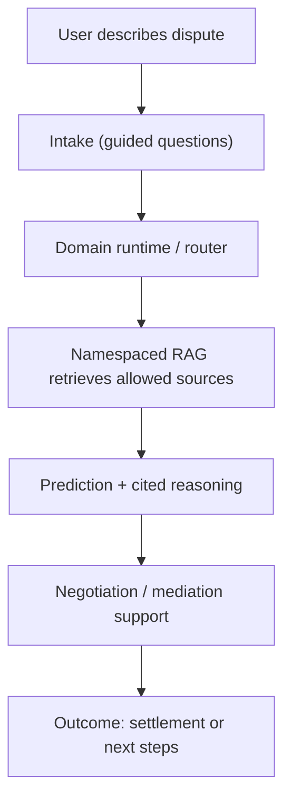
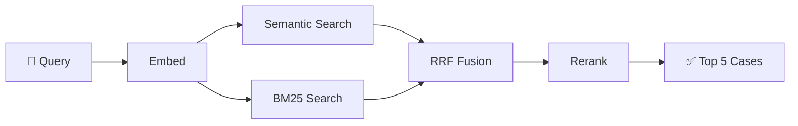

# Proposer

**Domain-Pluggable AI Mediation for UK Housing Disputes**

[](https://opensource.org/licenses/MIT)
[](https://www.python.org/downloads/)
[](https://www.typescriptlang.org/)
[](CONTRIBUTING.md)

> **Bridging the justice gap**: Proposer uses domain-specific RAG, Knowledge Graphs, and launch-gated evaluation to predict likely legal outcomes and facilitate fair settlements. The current compatibility baseline is `housing.deposit.v1`; the architecture now supports adjacent housing domains and closed-beta/research employment domains.

---

## 📖 Table of Contents

- [The Problem](#-the-problem)
- [Our Solution](#-our-solution)
- [How It Works](#-how-it-works)
- [Tech Stack](#-tech-stack)
- [Getting Started](#-getting-started)
- [Database Setup](#-database-setup-postgres)
- [Project Structure](#-project-structure)
- [Development](#-development)
- [Evaluation](#-evaluation)
- [Roadmap](#-roadmap)
- [Contributing](#-contributing)
- [License](#-license)
- [Changelog](#changelog) <!-- Added to Table of Contents -->

---

## 🎯 The Problem

Every year, people in the UK face high-stakes housing and workplace disputes where the legal answer is hard to understand, expensive to verify, and slow to test. Tenancy deposits are the current product baseline, but the same pattern appears across repairs, rent repayment orders, and employment disputes:

- 📉 **Justice Gap**: People often cannot justify solicitor costs for claims worth hundreds or a few thousand pounds
- ⏰ **Slow Formal Routes**: Tribunals, courts, ombudsman complaints, and early-conciliation paths can take months
- 🎭 **Information Asymmetry**: One side often has more legal knowledge, better records, or professional support
- 🤝 **Mediation Failure**: Traditional mediation is a "black box" when parties do not know what a legally realistic outcome looks like

**Result**: parties either accept unfair settlements or escalate without a clear view of likely outcomes.

---

## 💡 Our Solution

**Proposer** is an **outcome-driven mediation platform** built around explicit legal domains:

### Instead of "Let's talk about feelings"...
We say: **"Here is what similar decisions, guidance, and calculator traces suggest, with citations and uncertainty."**

### Key Innovations

1. **🔍 Glass-Box Reasoning**: Every material claim must be backed by retrieved evidence, statutory/guidance material, user evidence, or a deterministic calculator trace
2. **📊 Domain-Aware Prediction**: `housing.deposit.v1` stays as the compatibility baseline while adjacent housing and employment domains are configured separately
3. **🤖 Rational Mediation**: Uses predicted legal outcomes to anchor negotiations without pretending to be a solicitor
4. **🚦 Launch Gates**: New domains fail closed until corpus, eval, reviewer, leakage, and citation gates pass

### What Makes Us Different

| Feature | Traditional Mediation | Legal Chatbots | **Proposer** |
|---------|----------------------|----------------|--------------|
| **Data Source** | Mediator's intuition | Generic legal info | Domain-specific corpora + KG + eval gates |
| **Transparency** | Opaque | Vague | **Every claim cited** |
| **Goal** | Any agreement | User engagement | **Fair outcome aligned with law** |
| **Method** | Facilitative | Information retrieval | **Evaluative + predictive** |

---

## 🔧 How It Works

### Quick Diagram


```mermaid
flowchart TD
  U["User describes dispute"] --> I["Intake (guided questions)"]
  I --> D["Domain runtime / router"]
  D --> R["Namespaced RAG retrieves allowed sources"]
  R --> P["Prediction + cited reasoning"]
  P --> N["Negotiation / mediation support"]
  N --> O["Outcome: settlement or next steps"]
```

### The User Journey


```mermaid
graph LR
    A[User Describes Matter] --> B[Domain-Aware Intake]
    B --> C[Knowledge Graph Built]
    C --> D[Namespaced Retrieval]
    D --> E[Prediction Engine]
    E --> F[Cited Reasoning Trace]
    F --> G[Other Party Invited]
    G --> H[Shadow Mediator]
    H --> I[Settlement or Next Steps]
```

### 1️⃣ **Intelligent Intake**
Instead of static forms, an AI agent asks dynamic questions:
- "You mentioned damp and mould. Did you report it in writing?"
- "Is this about deposit deductions, deposit non-protection, repairs, or something else?"
- "Do you have photos, inventory reports, correspondence, or decision documents?"

### 2️⃣ **Hybrid Analysis**
Our system combines two AI approaches:

**Retrieval-Augmented Generation (RAG)** ✅ *Implemented*
- **Hybrid Search**: Combines semantic embeddings (OpenAI) + BM25 keyword search
- **Section-Aware**: Chunks legal documents by Background/Facts/Reasoning/Decision
- **Domain Namespaces**: Separates deposit, repairs, property-chamber RRO, and employment corpora
- **Domain Reranking**: Prioritizes by issue type, recency, forum, source kind, region, and evidence similarity
- **Uncertainty Detection**: Flags when no similar cases found


```mermaid
flowchart LR
    A["🔎 Query"] --> B["Embed"]
    B --> C["Semantic Search"]
    B --> D["BM25 Search"]
    C --> E["RRF Fusion"]
    D --> E
    E --> F["Rerank"]
    F --> G["✅ Top 5 Cases"]
```

**Knowledge Graph (KG)** ✅ *Implemented*
- Nodes: Parties, Evidence, Issues, Claims
- Edges: "Evidence supports claim", "Event occurred before tenancy end"
- Domain metadata and ontology validation prevent forum/remedy mixing
- Ensures logical consistency

### 3️⃣ **Transparent Prediction**
The system generates a **Reasoning Trace**:
- ✅ Key issues identified
- 📄 Relevant evidence from your case
- ⚖️ Analogous precedent cases (cited)
- 🎯 Predicted outcome with confidence score
- ❓ Missing information that could change the outcome

**Example Output**:
> "Based on 8 similar cases where landlords claimed carpet damage without check-in inventory, tenants recovered an average of £780 (85% confidence). Key precedent: *Smith v. Jones Properties, 2022* where tribunal ruled landlords cannot prove pre-existing damage without baseline evidence."

### 4️⃣ **Shadow Mediation**
An AI mediator monitors negotiations in real-time:
- Calculates **ZOPA** (Zone of Possible Agreement)
- Interjects when offers are unrealistic
- Suggests fair settlement packages

**Example Nudge**:
> "⚠️ Note: In 92% of similar cases where no check-in inventory exists, the landlord loses the full claim. Current offer (£200 refund) is below the predicted range (£700-900)."

---

## 🛠️ Tech Stack

### Backend
- **FastAPI** (Python 3.11+): Async API with type safety
- **Langfuse**: LLM observability and tracing (no LangChain; native async orchestration via FastAPI, asyncio, and aiohttp)
- **ChromaDB**: Vector embeddings for RAG retrieval (local development, Pinecone-ready)
- **Postgres + Alembic**: Primary app state, domain metadata, predictions, KG projections, mediation state
- **Knowledge Graph package**: Structured dispute facts with domain-aware ontology validation
- **Supabase**: PostgreSQL database + Auth + Storage

### Frontend
- **Next.js 16** (App Router): React framework with SSR
- **TypeScript**: Type-safe development
- **shadcn/ui** + **Tailwind CSS**: Modern UI components
- **Supabase Auth**: User authentication

### AI/ML
- **Primary LLM**: Claude 3.5 Sonnet (best reasoning)
- **Fallback LLM**: Claude 3.5 Haiku
- **Embeddings**: text-embedding-3-small (OpenAI)
- **Observability**: Langfuse (LLM tracing and monitoring)

### Infrastructure
- **Hosting**: Railway (planned) and Cloudflare (web hosting)
- **Monitoring**: Langfuse (LLM observability), structlog (application logging)
- **Storage**: Supabase Storage (evidence files with local fallback)
- **CI/CD**: GitHub Actions (planned)
- **Package Manager**: pip (Python), npm (frontend)

---

## 🚀 Getting Started

### Prerequisites

- **Node.js** 18+ and **npm** 9+
- **Python** 3.11+
- **PostgreSQL** 14+ (via Supabase)
- **Docker** (optional, for local Neo4j)
- **API Keys**: 
  - Anthropic (Claude) - **Required**
  - OpenAI (embeddings) - **Required**

### Installation

```bash
# Clone the repository
git clone https://github.com/yourusername/proposer.git
cd proposer

# Set up Python environment (backend + packages)
python -m venv venv
source venv/bin/activate  # On Windows: venv\Scripts\activate
pip install -r requirements.txt

# Set up environment variables
cp .env.example .env
# Edit .env with your API keys:
# - ANTHROPIC_API_KEY=sk-ant-your-key
# - OPENAI_API_KEY=sk-your-key
# - ENABLED_DOMAINS=housing.deposit.v1
# - DEFAULT_DOMAIN=housing.deposit.v1
# - DOMAIN_STRICT_EVAL_GATES=false  # local dev only unless gate artifacts exist
# - SUPABASE_URL=your-supabase-url (optional)
# - SUPABASE_KEY=your-supabase-key (optional)

# Install frontend dependencies
cd apps/web
npm install
cd ../..

# Start backend API
python scripts/api.py
# API available at: http://localhost:8000
# API Docs at: http://localhost:8000/docs

# Start frontend (in a new terminal)
cd apps/web
npm run dev
# Frontend available at: http://localhost:3000
```

**Services:**
- Frontend: http://localhost:3000
- Backend API: http://localhost:8000
- API Docs (Swagger): http://localhost:8000/docs

### Quick Test

```bash
# ===== RAG PIPELINE TESTS =====
# Test BAILII scraper (dry run - lists cases without downloading)
python -m scripts.scrapers.bailii_scraper --dry-run --years 2024

# View scraper statistics
python -m scripts.scrapers.bailii_scraper --stats

# Test PDF extraction (no API key needed)
python scripts/rag.py test-extract data/raw/bailii/adjacent-cases/2023/LON_00BK_HMF_2022_0227/decision.pdf

# Ingest PDFs into RAG index (requires OPENAI_API_KEY)
export OPENAI_API_KEY=sk-your-key-here
python scripts/rag.py ingest --pdf-dir data/raw/bailii

# Query for similar cases
python scripts/rag.py query "tenant deposit not protected within 30 days"
python scripts/rag.py query "damp mould repairs housing association"

# View RAG index statistics
python scripts/rag.py stats

# ===== CHAT API TESTS =====
# Test intake agent (CLI)
export ANTHROPIC_API_KEY=sk-ant-your-key-here
python scripts/intake.py chat

# Test intake agent (API)
# Start backend first: python scripts/api.py
curl -X POST http://localhost:8000/chat/start \
  -H "Content-Type: application/json" \
  -d '{"role": "tenant"}'

# Route/classify a matter when the domain router is enabled
curl -X POST http://localhost:8000/chat/route \
  -H "Content-Type: application/json" \
  -d '{"text": "My housing association has ignored damp and mould reports"}'

# Continue conversation
curl -X POST http://localhost:8000/chat/message \
  -H "Content-Type: application/json" \
  -d '{"session_id": "your-session-id", "message": "123 Main Street, London"}'

# ===== PREDICTION TESTS =====
# Generate prediction for a case
curl -X POST http://localhost:8000/predictions/generate \
  -H "Content-Type: application/json" \
  -d '{"case_id": "your-case-id"}'
```

---

## 🗄️ Database Setup (Postgres)

Phase 1-9 of the SHA-102 migration moved user-facing state from JSON files
under `data/<entity>/` into Postgres. Local development uses Docker Compose:

```bash
make db-up        # spin up Postgres 16 in Docker
make migrate      # run alembic upgrade head
make test         # full test suite (API + DB)
```

To reset the local database during development:

```bash
make db-reset     # drops volumes, brings up fresh Postgres, re-runs migrations
                  # local-only; refuses to run with APP_ENV=production
```

For test isolation, `pytest-postgresql` spawns its own Postgres process per
test session and clones the migrated schema into per-test databases. Local
Postgres binaries (`pg_ctl`, `postgres`) must be on `PATH` for tests:

```bash
brew install postgresql@16
export PATH="/opt/homebrew/opt/postgresql@16/bin:$PATH"
```

### Production safety

`APP_ENV=production` forces `APIConfig` to refuse:
- Missing `DATABASE_URL`
- `localhost` / `proposer-dev` credentials
- Non-TLS connection strings (sslmode must be `require` / `verify-ca` / `verify-full`)

Use `python -m scripts.migrations.print_db_target --database-url "$DATABASE_URL"`
to safely preview the target before any cutover step. Passwords are never printed.

### Migrating JSON state into Postgres

For one-time backfill of the existing JSON data:

```bash
# 1. Audit the source
python -m scripts.migrations.audit_json_stores --data-dir ./data \
    --out data/_migration_audit_report.json

# 2. Dry-run the backfill (validates, no writes)
python -m scripts.migrations.backfill_json_to_postgres --data-dir ./data --dry-run

# 3. Commit (writes Postgres rows in FK-correct order, idempotent)
python -m scripts.migrations.backfill_json_to_postgres --data-dir ./data --commit

# 4. Verify round-trip identity (every JSON file == repo-loaded entity)
python -m scripts.migrations.backfill_json_to_postgres --data-dir ./data --verify
```

### Rollback insurance

`scripts/migrations/dump_postgres_to_json.py` reverses the operation. It
dumps every Postgres entity back into the original JSON-on-disk shape:

```bash
python -m scripts.migrations.dump_postgres_to_json --out /path/to/rollback-dump
```

The full rollback runbook (write freeze, snapshot, decision tree) is in
[`docs/superpowers/specs/2026-04-29-postgres-migration-design.md`](docs/superpowers/specs/2026-04-29-postgres-migration-design.md).

---

## 📁 Project Structure

```
proposer/
├── apps/
│   ├── web/                    # Next.js frontend
│   │   ├── app/                # App Router pages
│   │   ├── components/         # React components
│   │   └── lib/                # Utilities, API client
│   ├── api/                    # FastAPI backend
│   │   ├── src/
│   │   │   ├── routers/        # API endpoints
│   │   │   ├── services/       # Business logic
│   │   │   └── models/         # Database models
│   │   └── tests/              # API tests
│   └── workers/                # Background jobs (scraping, embeddings)
│
├── packages/
│   ├── domain_core/            # Domain specs, forum profiles, retrieval namespaces
│   ├── shared/                 # Shared TypeScript types
│   ├── rag_engine/             # RAG pipeline (Python) ✅ IMPLEMENTED
│   │   ├── extractors/         # PDF extraction, text cleaning
│   │   ├── chunking/           # Legal document chunking
│   │   ├── embeddings/         # OpenAI embeddings
│   │   ├── vectorstore/        # ChromaDB storage
│   │   ├── retrieval/          # Hybrid search, reranking
│   │   ├── pipeline.py         # Main orchestrator
│   │   └── cli.py              # CLI interface
│   ├── kg_builder/             # Domain-aware Knowledge Graph (Python)
│   ├── llm_orchestrator/       # LLM agents, routing, prompt packs (Python)
│   └── legal-db/               # Database schemas
│
├── data/
│   ├── raw/                    # Scraped tribunal decisions
│   │   └── bailii/             # BAILII scraper output
│   │       ├── deposit-cases/  # Deposit baseline corpus when available
│   │       ├── adjacent-cases/ # Related housing cases (RRO, HMO, repairs)
│   │       └── other-cases/    # All other tribunal cases
│   ├── eval/                   # Routing/gold/negative eval sets
│   ├── eval_artifacts/         # Domain launch-gate artifacts
│   ├── regression/             # Domain-parity regression fixtures
│   ├── processed/              # Cleaned, structured cases
│   ├── embeddings/             # ChromaDB vector store
│   └── test-cases/             # Evaluation datasets
│
├── scripts/
│   ├── scrapers/               # Data collection scrapers
│   │   ├── bailii_scraper.py   # BAILII tribunal decisions scraper
│   │   ├── housing_ombudsman/  # Housing Ombudsman determinations
│   │   ├── govuk_property_tribunal/   # FTT(PC) RRO scraper
│   │   ├── govuk_rent_determination/  # FTT(PC) MNR rent-determination scraper
│   │   ├── config.py           # Keywords and settings
│   │   ├── models.py           # Pydantic data models
│   │   ├── parsers.py          # HTML parsing
│   │   ├── downloader.py       # Async HTTP client
│   │   └── progress.py         # SQLite progress tracking
│   ├── ingest/                 # Per-namespace ingestion (chunk → embed → Chroma + BM25)
│   ├── build-embeddings.py     # Generate vector store
│   └── evaluate-predictions.py # Accuracy testing
│
├── docs/
│   ├── architecture.md         # System design
│   ├── api-spec.yaml           # OpenAPI specification
│   ├── evaluation-results.md   # Performance metrics
│   └── scraping-runs.md        # Operational log of every live scrape pilot
│
├── .cursorrules                # AI assistant context
├── CLAUDE.md                   # Project philosophy & roadmap
├── README.md                   # You are here
├── CHANGELOG.md                # See recent changes <!-- Added link to changelog -->
└── docker-compose.yml          # Local development setup
```

---

## 💻 Development

### Running Tests

```bash
# RAG Engine tests (141 tests covering all components)
python scripts/run_tests.py
python scripts/run_tests.py --unit-only     # Skip integration tests
python scripts/run_tests.py --coverage      # With coverage report
python scripts/run_tests.py -k "test_bm25"  # Filter specific tests

# Deposit/RRO RAG retrieval quality tests
python scripts/test_deposit_rag_quality.py

# Housing Ombudsman RAG retrieval quality tests
python scripts/test_ombudsman_rag_quality.py --data-dir "$DATA_DIR"

# Build Housing Ombudsman 50-case stratified eval manifest
python scripts/eval/build_housing_ombudsman_stratified_eval.py --data-dir "$DATA_DIR"

# Backend API tests
cd apps/api && pytest

# Frontend tests
cd apps/web && npm test

# Evaluation tests (critical for accuracy tracking)
python scripts/evaluate-predictions.py  # Coming soon
```

### Key Development Commands

```bash
# ===== START SERVICES =====
# Backend API (from project root)
python scripts/api.py
# Runs at: http://localhost:8000

# Frontend (from project root)
cd apps/web && npm run dev
# Runs at: http://localhost:3000

# ===== DATA COLLECTION =====
# Scrape tribunal decisions from BAILII
python -m scripts.scrapers.bailii_scraper --years 2024
python -m scripts.scrapers.bailii_scraper --year-range 2020-2025
python -m scripts.scrapers.bailii_scraper --resume  # Resume interrupted scrape
python -m scripts.scrapers.bailii_scraper --stats   # View scraper stats

# ===== RAG PIPELINE =====
# Ingest PDFs into vector store (requires OPENAI_API_KEY)
python scripts/rag.py ingest --pdf-dir data/raw/bailii/deposit-cases
python scripts/rag.py ingest --pdf-dir data/raw/bailii/adjacent-cases

# Query for similar cases
python scripts/rag.py query "deposit not protected section 213"
python scripts/rag.py query "cleaning claim" --region LON --year 2023
python scripts/rag.py query "damage without inventory" --json-output

# View RAG index statistics
python scripts/rag.py stats

# Rebuild BM25 index (if corrupted)
python scripts/rebuild_bm25.py

# Clear and rebuild entire index
python scripts/rag.py clear
python scripts/rag.py ingest --pdf-dir data/raw/bailii

# ===== INTAKE AGENT =====
# Test intake agent via CLI (requires ANTHROPIC_API_KEY)
python scripts/intake.py chat

# ===== TESTING =====
# Run RAG engine tests
python scripts/run_tests.py
python scripts/run_tests.py --unit-only  # Skip integration tests
python scripts/run_tests.py --coverage   # With coverage report

# Test deposit/RRO RAG retrieval quality
python scripts/test_deposit_rag_quality.py

# Test Housing Ombudsman retrieval quality
python scripts/test_ombudsman_rag_quality.py --data-dir "$DATA_DIR"

# Build Housing Ombudsman 50-case stratified eval manifest
python scripts/eval/build_housing_ombudsman_stratified_eval.py --data-dir "$DATA_DIR"

# Backend tests
cd apps/api && pytest

# Frontend tests
cd apps/web && npm test

# ===== CODE QUALITY =====
# Type checking (frontend)
cd apps/web && npm run type-check

# Linting (frontend)
cd apps/web && npm run lint

# Format code (frontend)
cd apps/web && npm run format
```

### Coding Standards

See [`.cursorrules`](.cursorrules) for detailed guidelines. Key principles:

1. **Legal Safety First**: Every output must be framed as information, not advice
2. **Cite or Abstain**: Never generate claims without retrieval evidence
3. **Evaluation-Driven**: Measure accuracy, calibration, and fairness
4. **Transparent Reasoning**: Every prediction must include reasoning trace
5. **Type Safety**: Use TypeScript on frontend, Pydantic on backend

---

## 📊 Evaluation

We track multiple metrics to ensure quality:

### Prediction Accuracy
- **Per-Domain Win/Loss Classification**: % correct predictions inside each supported domain
- **Amount Prediction**: Mean Absolute Error (MAE)
- **Calibration**: Brier Score, reliability diagrams
- **Target**: >70% accuracy, Brier Score <0.20

### Explanation Quality
- **Citation Accuracy**: % of claims with valid case citations
- **Hallucination Rate**: % of unsupported claims
- **Leakage Controls**: target-source exclusion, temporal cutoffs, and cross-domain retrieval checks
- **Target**: <2% hallucination rate

### Mediation Efficacy
- **Settlement Rate**: % of cases settled vs. escalated
- **Settlement Fairness**: MAE between suggested settlement and actual tribunal outcome
- **Target**: Settlements within £100 of predicted outcome

### System Performance
- **Response Time**: Median time for full analysis
- **Cost per Case**: LLM API costs per prediction
- **Target**: <30 seconds, <£0.50 per case

See [`docs/evaluation-results.md`](docs/evaluation-results.md) for detailed metrics, and [`docs/scraping-runs.md`](docs/scraping-runs.md) for the operational log of every live corpus pilot (commands, hit rates, bugs uncovered, ingest counts).

### Domain Launch Gates

New domains are not just added to a prompt. They require:
- a domain YAML in `packages/domain_core/domains/`
- a retrieval namespace and corpus version
- prompt-pack, ontology, and citation-verifier hashes
- positive gold cases and negative/adversarial eval sets
- reviewer sign-off and a launch-gate artifact

Runtime fails closed when `DOMAIN_STRICT_EVAL_GATES=true` and the required artifact is missing or stale.

---

## 🤝 Contributing

We welcome contributions! Here's how to get involved:

### Contribution Process

1. **Fork** the repository
2. **Create a branch**: `git checkout -b feature/your-feature-name`
3. **Add tests** for new functionality
4. **Run evaluation**: Ensure no accuracy regression
5. **Submit PR** with clear description

### Code of Conduct

- Be respectful and constructive
- Prioritize user safety and legal compliance
- Document your changes thoroughly
- Focus on improving access to justice

---

## 📄 License

This project is licensed under the **MIT License** - see [LICENSE](LICENSE) for details.

### Important Legal Disclaimer

⚠️ **Proposer is not a law firm and does not provide legal advice.** All outputs are informational only and based on domain-specific source analysis, past decisions, guidance, user-provided evidence, and deterministic calculator traces where available. Users should consult qualified solicitors or advisers for advice specific to their circumstances.

By using this software, you acknowledge that:
- Predictions are probabilistic and not guaranteed
- Settlement suggestions are for reference only
- The developers assume no liability for outcomes
- This tool does not create an attorney-client relationship

---

## 🙏 Acknowledgments

- **First-tier Tribunal (Property Chamber)** for publishing decisions
- **Housing Ombudsman** for adjudication data
- **Anthropic** for Claude API access
- **Imperial College London** for academic support
- The open-source community for foundational libraries

---

## 📞 Contact

**Mohamed** - Computer Science @ Imperial College London
- Building in public: [TikTok](https://tiktok.com/@mshar1f) | [LinkedIn](https://linkedin.com/in/mohamed-sharif-stemm
- Email: mohamed.sharif22@imperial.ac.uk
- Project Link: [https://github.com/MSH4R1F/proposer](https://github.com/MSH4R1F/proposer)

---

## 📝 Changelog

See [CHANGELOG.md](CHANGELOG.md) for a detailed list of recent updates, features, fixes, and improvements.

**Built with ❤️ to bridge the justice gap, one dispute at a time.**
