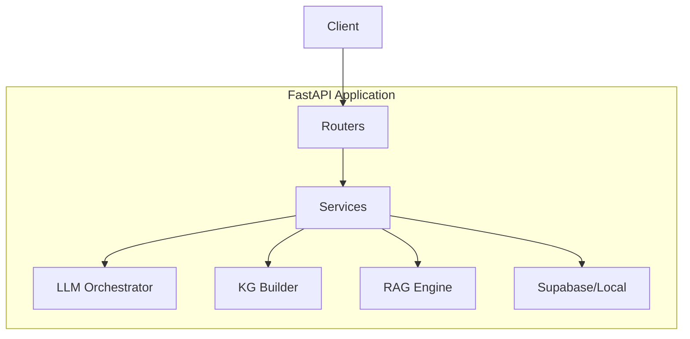
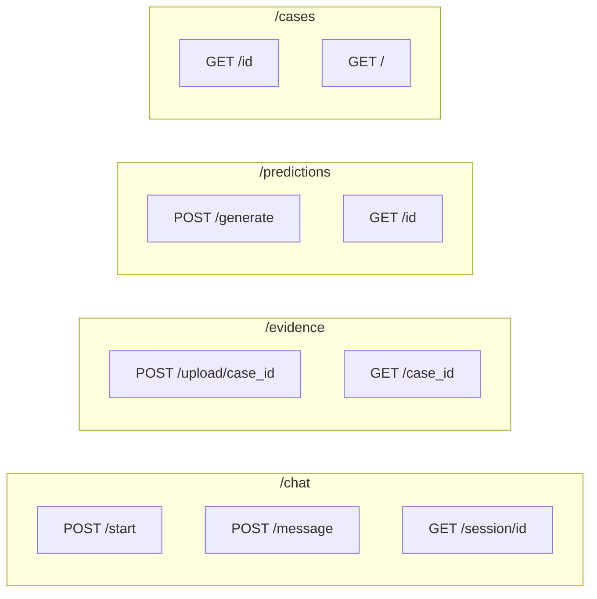

# API Application

FastAPI REST API for the legal mediation system.

## Architecture



## Endpoints



## Running

```bash
# Development
python scripts/api.py --reload

# Production
python scripts/api.py --host 0.0.0.0 --port 8000
```

## Services

| Service | Purpose |
|---------|---------|
| `IntakeService` | Manages chat sessions and conversations |
| `PredictionService` | Generates predictions with RAG + KG |
| `StorageService` | File uploads to Supabase or local |

## Configuration

```bash
# Required
export ANTHROPIC_API_KEY=sk-ant-...
export OPENAI_API_KEY=sk-...

# Optional (Supabase)
export SUPABASE_URL=https://...
export SUPABASE_KEY=...
export SUPABASE_BUCKET=evidence
```

## API Docs

Visit `http://localhost:8000/docs` for interactive Swagger UI.

## Project Structure

```
apps/api/
├── src/
│   ├── main.py           # FastAPI app
│   ├── config.py         # Environment config
│   ├── routers/
│   │   ├── chat.py       # Chat endpoints
│   │   ├── evidence.py   # File uploads
│   │   ├── predictions.py # Predictions
│   │   └── cases.py      # Case management
│   └── services/
│       ├── intake_service.py
│       ├── prediction_service.py
│       └── storage_service.py
└── tests/
```
