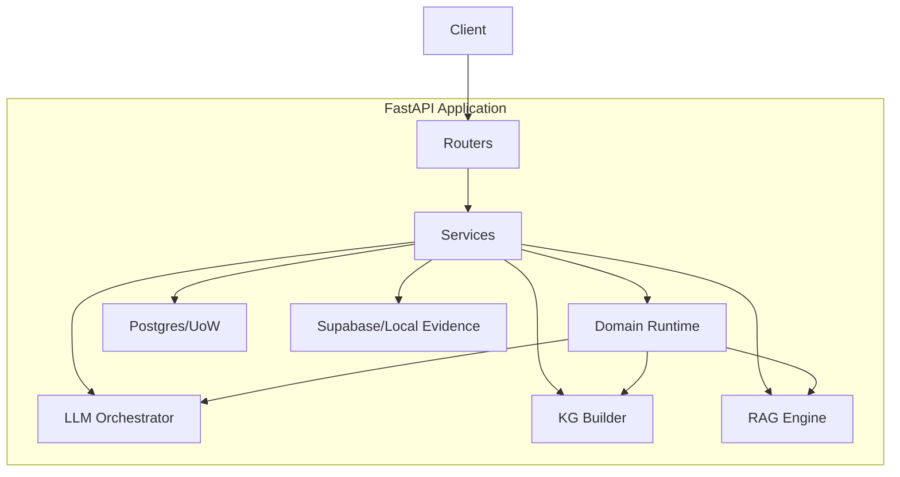
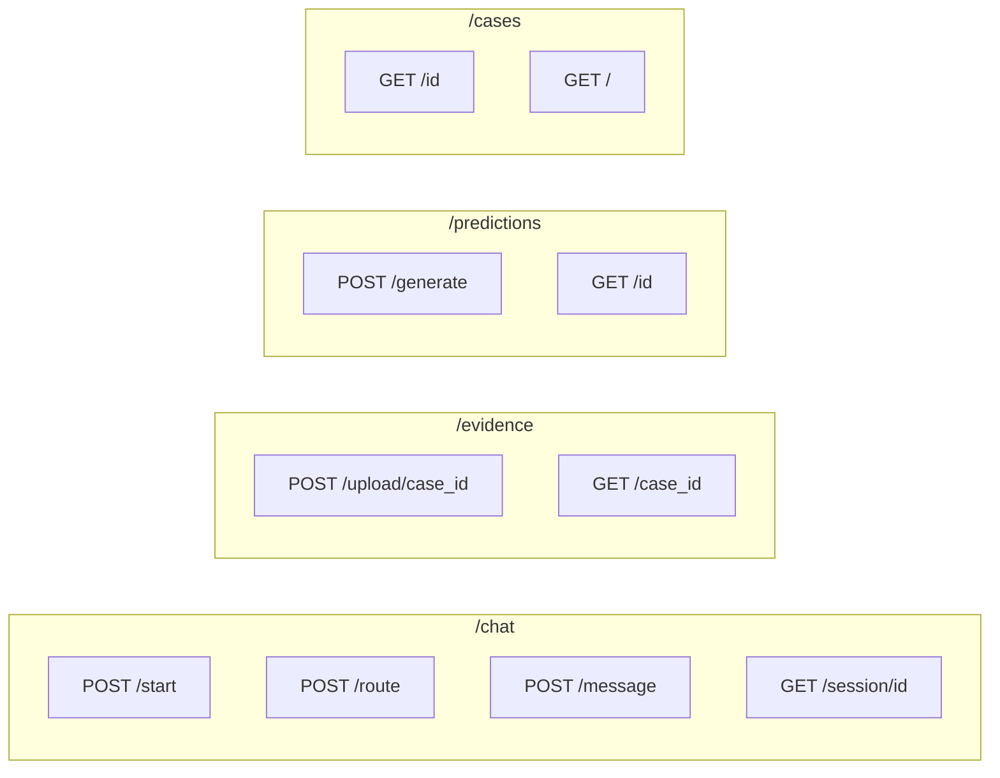

# API Application

FastAPI REST API for Proposer's domain-pluggable legal mediation system.

The API still supports the existing deposit-dispute flow, but requests now run through a domain runtime. The default domain is `housing.deposit.v1`; adjacent housing and employment domains are enabled only when their stage, allowlist, retrieval namespace, and eval-gate policy allow it.

## Architecture


```mermaid
flowchart TB
    subgraph API["FastAPI Application"]
        Routes[Routers] --> Services[Services]
        Services --> Domain[Domain Runtime]
        Services --> LLM[LLM Orchestrator]
        Services --> KG[KG Builder]
        Services --> RAG[RAG Engine]
        Services --> DB[Postgres/UoW]
        Services --> Storage[Supabase/Local Evidence]
    end

    Client[Client] --> Routes
    Domain --> LLM
    Domain --> KG
    Domain --> RAG
```

## Endpoints


```mermaid
flowchart LR
    subgraph Chat["/chat"]
        Start[POST /start]
        Route[POST /route]
        Message[POST /message]
        Session[GET /session/id]
    end

    subgraph Evidence["/evidence"]
        Upload[POST /upload/case_id]
        List[GET /case_id]
    end

    subgraph Predictions["/predictions"]
        Generate[POST /generate]
        Get[GET /id]
    end

    subgraph Cases["/cases"]
        GetCase[GET /id]
        ListCases[GET /]
    end
```

## Running

```bash
# Development
python scripts/api.py --reload

# Production
python scripts/api.py --host 0.0.0.0 --port 8000
```

## Services

| Service | Purpose |
|---------|---------|
| `IntakeService` | Manages chat sessions and conversations |
| `PredictionService` | Generates predictions with RAG + KG |
| `DomainRuntimeContext` | Resolves domain specs, stage/mode gates, allowlists, and eval artifacts |
| `StorageService` | File uploads to Supabase or local |

## Configuration

```bash
# Required
export ANTHROPIC_API_KEY=sk-ant-...
export OPENAI_API_KEY=sk-...

# Optional (Supabase)
export SUPABASE_URL=https://...
export SUPABASE_KEY=...
export SUPABASE_BUCKET=evidence

# Multi-domain runtime
export ENABLED_DOMAINS=housing.deposit.v1
export DEFAULT_DOMAIN=housing.deposit.v1
export DOMAIN_ROUTER_ENABLED=false
export DOMAIN_STRICT_EVAL_GATES=false  # local dev only unless gate artifacts exist
```

## API Docs

Visit `http://localhost:8000/docs` for interactive Swagger UI.

## Project Structure

```
apps/api/
├── src/
│   ├── main.py           # FastAPI app
│   ├── config.py         # Environment config
│   ├── domain_runtime.py # Domain resolution, gates, allowlists
│   ├── routers/
│   │   ├── chat.py       # Chat endpoints
│   │   ├── evidence.py   # File uploads
│   │   ├── predictions.py # Predictions
│   │   └── cases.py      # Case management
│   └── services/
│       ├── intake_service.py
│       ├── prediction_service.py
│       └── storage_service.py
└── tests/
```
