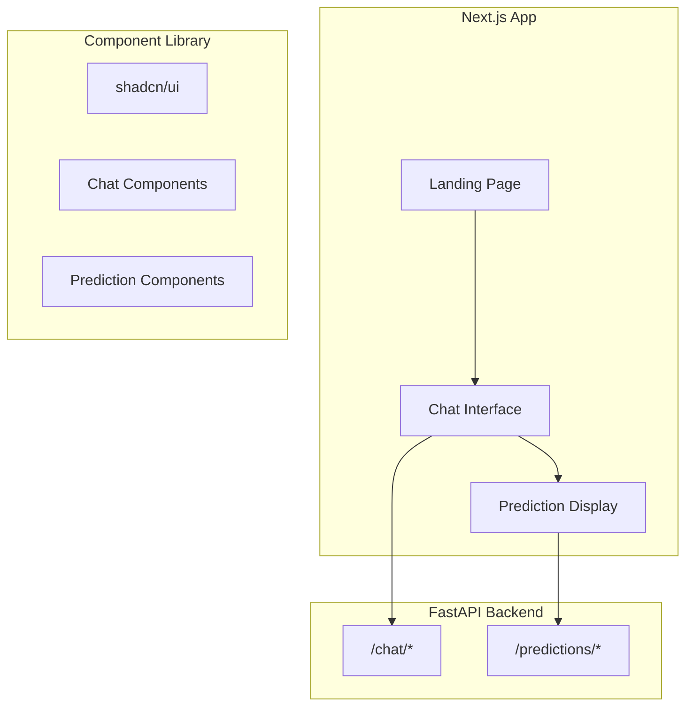

# Proposer Web Frontend

Next.js 14+ frontend for the Proposer legal mediation system.

## Tech Stack

- **Framework**: Next.js 14+ (App Router)
- **UI Library**: shadcn/ui + Tailwind CSS
- **Language**: TypeScript
- **State Management**: React hooks + localStorage

## Architecture



## Pages

| Route | Description |
|-------|-------------|
| `/` | Landing page with hero, features, CTA |
| `/chat` | New intake session |
| `/chat/[sessionId]` | Resume existing session |
| `/prediction/[caseId]` | Prediction results |

## Key Components

### Chat Components (`components/chat/`)
- `ChatContainer` - Main wrapper with state management
- `ChatHeader` - Session info, stage, completeness
- `MessageList` - Scrollable message container
- `MessageBubble` - User/assistant message styling
- `ChatInput` - Input field with send button
- `RoleSelector` - Tenant/Landlord selection
- `ProgressIndicator` - 10-stage visual stepper
- `CompletenessBar` - Progress percentage

### Prediction Components (`components/prediction/`)
- `PredictionCard` - Main results wrapper
- `OutcomeDisplay` - Win/Loss/Split visualization
- `ConfidenceGauge` - Circular confidence meter
- `SettlementRange` - Financial summary
- `IssuePredictionList` - Per-issue breakdown
- `ReasoningTrace` - Expandable reasoning steps
- `CitationCard` - Case citation display
- `LegalDisclaimer` - Prominent warning

## Getting Started

```bash
# Install dependencies
npm install

# Start development server
npm run dev

# Build for production
npm run build

# Start production server
npm start
```

## Environment Variables

```bash
# .env.local
NEXT_PUBLIC_API_URL=http://localhost:8000
```

## API Integration

The frontend integrates with the FastAPI backend:

```typescript
// Chat API
POST /chat/start           // Start new session
POST /chat/set-role        // Set user role
POST /chat/message         // Send message
GET  /chat/session/{id}    // Get session state

// Predictions API
POST /predictions/generate // Generate prediction
GET  /predictions/{id}     // Get prediction
```

## Project Structure

```
apps/web/
├── app/
│   ├── layout.tsx              # Root layout
│   ├── globals.css             # Tailwind + CSS vars
│   ├── page.tsx                # Landing page
│   ├── (chat)/
│   │   ├── page.tsx            # New session
│   │   └── [sessionId]/page.tsx
│   └── prediction/
│       └── [caseId]/page.tsx
├── components/
│   ├── ui/                     # shadcn components
│   ├── chat/                   # Chat components
│   ├── prediction/             # Prediction components
│   └── shared/                 # Shared components
├── lib/
│   ├── api/                    # API client
│   ├── hooks/                  # React hooks
│   ├── types/                  # TypeScript types
│   ├── constants/              # Stage mappings
│   └── utils/                  # Utilities
└── [config files]
```

## Features

### Intake Flow (10 Stages)
1. **Greeting** - Welcome and role selection
2. **Role** - Confirm tenant/landlord
3. **Property** - Address and details
4. **Tenancy** - Dates, rent, agreement
5. **Deposit** - Amount, protection status
6. **Issues** - What's disputed
7. **Evidence** - Supporting documents
8. **Claims** - Specific amounts
9. **Summary** - Full account
10. **Confirm** - Review and confirm

### Prediction Display
- Overall outcome with confidence
- Settlement range
- Per-issue breakdown
- Expandable reasoning trace
- Case citations
- Legal disclaimer

## Dependencies

```json
{
  "next": "^14.2.0",
  "react": "^18.3.0",
  "typescript": "^5.4.0",
  "@radix-ui/*": "Various Radix primitives",
  "tailwindcss": "^3.4.3",
  "lucide-react": "^0.400.0",
  "class-variance-authority": "^0.7.0",
  "clsx": "^2.1.0",
  "tailwind-merge": "^2.3.0"
}
```
