# Legal Mediation System - Architecture Overview

This document provides a comprehensive overview of the Proposer platform architecture, showing how the frontend (Next.js), backend (FastAPI), and core packages (RAG, KG, LLM) work together.

## System Architecture

```mermaid
graph TB
    %% Frontend Layer
    subgraph Frontend["🌐 Frontend (Next.js 16 App Router)"]
        HomePage["Home Page<br/>/"]
        ChatListPage["Chat List<br/>/chat"]
        ChatSessionPage["Chat Session<br/>/chat/[sessionId]"]
        PredictionPage["Prediction View<br/>/prediction/[caseId]"]
        AdminPage["Admin<br/>/admin"]
        
        subgraph Components["React Components"]
            ChatContainer["ChatContainer"]
            IntakeSidebar["IntakeSidebar"]
            MessageList["MessageList"]
            PredictionViewer["PredictionViewer"]
            ReasoningTrace["ReasoningTrace"]
        end
        
        subgraph APIClients["API Client Layer"]
            ChatAPIClient["chatApi"]
            PredictionsAPIClient["predictionsApi"]
            APIClient["api (fetch wrapper)"]
        end
    end

    %% API Layer
    subgraph Backend["⚙️ Backend API (FastAPI)"]
        MainApp["main.py<br/>FastAPI App"]
        
        subgraph Routers["API Routers (Endpoints)"]
            ChatRouter["/chat<br/>• POST /start<br/>• POST /message<br/>• POST /set-role<br/>• GET /session/:id<br/>• DELETE /session/:id<br/>• GET /sessions"]
            PredictionsRouter["/predictions<br/>• POST /generate<br/>• GET /:id<br/>• GET /case/:caseId"]
            DisputesRouter["/disputes<br/>• POST /create<br/>• POST /validate-invite<br/>• POST /join<br/>• GET /:id"]
            EvidenceRouter["/evidence<br/>• POST /upload/:caseId<br/>• GET /:caseId<br/>• DELETE /:evidenceId"]
            CasesRouter["/cases<br/>• GET /:caseId<br/>• GET /"]
        end
        
        subgraph Services["Service Layer"]
            IntakeService["IntakeService<br/>• Session Management<br/>• Conversation Flow<br/>• Case File Building"]
            PredictionService["PredictionService<br/>• Prediction Generation<br/>• RAG Integration<br/>• KG Integration"]
            DisputeService["DisputeService<br/>• Dispute Creation<br/>• Invite Codes<br/>• Party Linking"]
            StorageService["StorageService<br/>• File Uploads<br/>• Supabase Integration<br/>• Evidence Processing"]
        end
    end

    %% Core Packages Layer
    subgraph Packages["📦 Core Packages (Python)"]
        subgraph LLMOrchestrator["llm_orchestrator/"]
            IntakeAgent["IntakeAgent<br/>• Dynamic Questioning<br/>• Context Awareness<br/>• Completeness Tracking"]
            PredictionAgent["PredictionEngine<br/>• Prediction Synthesis<br/>• Reasoning Trace<br/>• Citation Generation"]
            ClaudeClient["ClaudeClient<br/>• Anthropic API<br/>• Structured Outputs<br/>• Error Handling"]
            FactExtractor["FactExtractor<br/>• Entity Extraction<br/>• Evidence Processing"]
        end
        
        subgraph KGBuilder["kg_builder/"]
            GraphBuilder["GraphBuilder<br/>• Node Creation<br/>• Edge Validation<br/>• Constraint Checking"]
            KGModels["KG Models<br/>• Nodes (Party, Evidence, Issue)<br/>• Edges (Supports, OccurredBefore)<br/>• Validators"]
            JSONStore["JSONGraphStore<br/>• Persistence<br/>• Retrieval"]
        end
        
        subgraph RAGEngine["rag_engine/"]
            RAGPipeline["RAGPipeline<br/>• Query Processing<br/>• Orchestration"]
            HybridRetriever["HybridRetriever<br/>• BM25 (keyword)<br/>• Semantic Search<br/>• Weighted Fusion"]
            ChromaStore["ChromaStore<br/>• Vector DB<br/>• Embeddings"]
            Reranker["Reranker<br/>• Relevance Scoring<br/>• Context Filtering"]
            LegalChunker["LegalChunker<br/>• Section Detection<br/>• Smart Chunking"]
        end
    end

    %% Data Layer
    subgraph DataLayer["💾 Data & Storage"]
        subgraph FileSystem["Local File System"]
            SessionsDir["data/sessions/<br/>Session JSON files"]
            KGDir["data/knowledge_graphs/<br/>KG JSON files"]
            PredictionsDir["data/predictions/<br/>Prediction JSON files"]
            DisputesDir["data/disputes/<br/>Dispute JSON files"]
        end
        
        subgraph VectorDB["Vector Database"]
            ChromaDB["ChromaDB<br/>• Embeddings<br/>• BM25 Index<br/>• data/embeddings/"]
        end
        
        subgraph ExternalStorage["External Storage"]
            Supabase["Supabase<br/>• PostgreSQL (Auth, Metadata)<br/>• Storage Buckets (Evidence)"]
        end
        
        subgraph CaseData["Case Data"]
            TribunalCases["Tribunal Decisions<br/>data/raw/bailii/<br/>~500+ PDFs"]
        end
    end

    %% External Services
    subgraph External["☁️ External Services"]
        Anthropic["Anthropic API<br/>Claude 3.5 Sonnet/Haiku"]
        OpenAI["OpenAI API<br/>text-embedding-3-large"]
    end

    %% Frontend Connections
    ChatSessionPage --> ChatContainer
    ChatSessionPage --> IntakeSidebar
    PredictionPage --> PredictionViewer
    PredictionViewer --> ReasoningTrace
    
    ChatContainer --> ChatAPIClient
    IntakeSidebar --> ChatAPIClient
    PredictionViewer --> PredictionsAPIClient
    
    ChatAPIClient --> APIClient
    PredictionsAPIClient --> APIClient
    APIClient -->|"HTTP/JSON"| MainApp

    %% Backend Router to Service Connections
    MainApp --> ChatRouter
    MainApp --> PredictionsRouter
    MainApp --> DisputesRouter
    MainApp --> EvidenceRouter
    MainApp --> CasesRouter
    
    ChatRouter --> IntakeService
    ChatRouter --> DisputeService
    PredictionsRouter --> PredictionService
    DisputesRouter --> DisputeService
    EvidenceRouter --> StorageService
    CasesRouter --> IntakeService

    %% Service to Package Connections
    IntakeService --> IntakeAgent
    IntakeService --> FactExtractor
    IntakeService --> GraphBuilder
    
    PredictionService --> PredictionAgent
    PredictionService --> RAGPipeline
    PredictionService --> GraphBuilder
    
    DisputeService --> GraphBuilder

    %% LLM Orchestrator Internal Connections
    IntakeAgent --> ClaudeClient
    PredictionAgent --> ClaudeClient
    PredictionAgent --> RAGPipeline
    
    %% RAG Engine Internal Connections
    RAGPipeline --> HybridRetriever
    RAGPipeline --> Reranker
    HybridRetriever --> ChromaStore
    
    %% KG Builder Connections
    GraphBuilder --> KGModels
    GraphBuilder --> JSONStore

    %% Data Persistence Connections
    IntakeService -.->|"Save/Load"| SessionsDir
    DisputeService -.->|"Save/Load"| DisputesDir
    PredictionService -.->|"Save/Load"| PredictionsDir
    GraphBuilder -.->|"Save/Load"| KGDir
    ChromaStore -.->|"Read/Write"| ChromaDB
    HybridRetriever -.->|"Query"| ChromaDB
    StorageService -.->|"Upload"| Supabase
    RAGPipeline -.->|"Load"| TribunalCases

    %% External Service Connections
    ClaudeClient -->|"API Calls"| Anthropic
    ChromaStore -->|"Generate Embeddings"| OpenAI

    %% Styling
    classDef frontend fill:#3b82f6,stroke:#1e40af,color:#fff
    classDef backend fill:#8b5cf6,stroke:#6d28d9,color:#fff
    classDef package fill:#10b981,stroke:#059669,color:#fff
    classDef data fill:#f59e0b,stroke:#d97706,color:#fff
    classDef external fill:#ef4444,stroke:#dc2626,color:#fff
    
    class HomePage,ChatListPage,ChatSessionPage,PredictionPage,AdminPage,ChatContainer,IntakeSidebar,MessageList,PredictionViewer,ReasoningTrace,ChatAPIClient,PredictionsAPIClient,APIClient frontend
    class MainApp,ChatRouter,PredictionsRouter,DisputesRouter,EvidenceRouter,CasesRouter,IntakeService,PredictionService,DisputeService,StorageService backend
    class IntakeAgent,PredictionAgent,ClaudeClient,FactExtractor,GraphBuilder,KGModels,JSONStore,RAGPipeline,HybridRetriever,ChromaStore,Reranker,LegalChunker package
    class SessionsDir,KGDir,PredictionsDir,DisputesDir,ChromaDB,Supabase,TribunalCases data
    class Anthropic,OpenAI external
```



## Data Flow Examples

### 1. Intake Chat Flow (User → Prediction)


### 2. Prediction Generation Flow


### 3. Multi-Party Dispute Flow


## Key Architectural Patterns

### 1. **Separation of Concerns**
- **Frontend**: UI/UX, user interactions, client-side state
- **API Routers**: HTTP request handling, validation, response formatting
- **Services**: Business logic orchestration, session management
- **Packages**: Domain-specific logic (LLM, RAG, KG)

### 2. **Dependency Injection**
- Services use FastAPI's `Depends()` for singleton management
- Lazy loading of expensive resources (RAG pipeline)

### 3. **Async/Await Throughout**
- All API endpoints and services use `async`/`await`
- Non-blocking I/O for LLM calls, file operations
- Better resource utilization for concurrent users

### 4. **Structured Data with Pydantic**
- All API requests/responses use Pydantic models
- Type safety + automatic validation
- Consistent data contracts between frontend and backend

### 5. **Modular Package Design**
- Each package (`llm_orchestrator`, `rag_engine`, `kg_builder`) can be used independently
- Clear interfaces and minimal coupling
- Easy to test in isolation

### 6. **Cite-or-Abstain RAG Pattern**
- LLM predictions MUST cite retrieved cases
- No predictions without supporting evidence
- Transparency and legal defensibility

### 7. **Hybrid Search (BM25 + Semantic)**
- Combines keyword matching (BM25) with semantic similarity
- Better recall for legal terms + conceptual similarity
- Reranking stage for precision

### 8. **Knowledge Graph Validation**
- Constraint checking (temporal logic, evidence chains)
- Confidence scores on extracted facts
- Filters low-confidence data from predictions

## Technology Choices & Rationale

| Component | Technology | Why? |
|-----------|-----------|------|
| **Frontend** | Next.js 16 (App Router) | Server components, file-based routing, optimized bundle |
| **UI Library** | shadcn/ui + Tailwind | Modern, accessible, customizable components |
| **Backend** | FastAPI | Async support, automatic OpenAPI docs, Pydantic integration |
| **LLM** | Claude 3.5 Sonnet | Best reasoning for legal analysis, structured outputs |
| **Embeddings** | OpenAI text-embedding-3-large | High quality, 3072 dimensions, good for legal text |
| **Vector DB** | ChromaDB | Lightweight, embeddable, sufficient for 500 cases |
| **Graph DB** | JSON files (Neo4j future) | Simple for MVP, JSON is debuggable, Neo4j later for complex queries |
| **Storage** | Supabase | PostgreSQL + Auth + File storage in one, generous free tier |
| **Auth** | Supabase Auth | JWT-based, integrates with PostgreSQL RLS |

## Scaling Considerations

### Current MVP Design (500 cases, <100 users)
- ✅ ChromaDB local (fast, simple)
- ✅ JSON file storage (easy debugging)
- ✅ In-memory session caching
- ✅ Single FastAPI instance

### Future Scale (10K+ cases, 1000+ users)
- 🔄 Migrate ChromaDB to Pinecone/Weaviate (managed, distributed)
- 🔄 PostgreSQL for sessions, cases, predictions (ACID, relations)
- 🔄 Neo4j for knowledge graphs (complex queries, graph algorithms)
- 🔄 Redis for session caching (distributed, persistent)
- 🔄 Horizontal scaling with load balancer
- 🔄 Langfuse for LLM observability (cost tracking, latency, quality)

## Security & Compliance

### Data Protection
- PII redaction during RAG ingestion (hash names, addresses)
- Supabase RLS (Row-Level Security) for multi-tenancy
- HTTPS only, secure cookie handling

### Legal Safety
- All predictions include disclaimer: "This is not legal advice"
- Conditional language throughout ("likely", "similar cases suggest")
- Citation-backed claims only (no hallucination)

### Prompt Injection Defense
- Treat user input as untrusted
- System prompts enforce role boundaries
- Output validation (check citations exist)

## Development Workflow

### Local Development
```bash
# Terminal 1: Backend
cd apps/api
source ../../venv/bin/activate
python -m uvicorn src.main:app --reload --port 8000

# Terminal 2: Frontend
cd apps/web
npm run dev

# Access:
# Frontend: http://localhost:3000
# API Docs: http://localhost:8000/docs
```

### Testing Strategy
- **Unit Tests**: Individual packages (RAG, KG, LLM clients)
- **Integration Tests**: API endpoints with mocked LLM
- **Evaluation Tests**: Prediction accuracy on gold standard set
- **E2E Tests**: Full user flows (Playwright/Cypress)

## Monitoring & Observability

### Current (MVP)
- Structured logging with `structlog`
- Console output with color-coded log levels
- Manual inspection of JSON files

### Planned
- **Langfuse**: LLM call tracing, token usage, latency
- **Sentry**: Error tracking, performance monitoring
- **Posthog**: User analytics, feature usage
- **Grafana**: System metrics (CPU, memory, request rate)

---

## Learning Resources for Key Concepts

### What is RAG (Retrieval-Augmented Generation)?
RAG is a technique where we **retrieve relevant information from a knowledge base** (in our case, past tribunal decisions) **before generating a response**. Think of it like:
- You're writing an essay and you first look up relevant books/articles → that's **Retrieval**
- Then you synthesize the information into your own words → that's **Generation**
- **Why?** LLMs don't "know" specific tribunal decisions, but they're great at synthesizing information if we give them the right context.

### What is a Knowledge Graph?
A **Knowledge Graph (KG)** is a way to represent information as **nodes (entities) and edges (relationships)**:
- **Nodes**: Tenant, Landlord, Evidence (receipt), Claim (£500 for cleaning)
- **Edges**: "Receipt → Supports → Cleaning Claim", "Tenancy → Ended → 2024-01-15"
- **Why?** It helps us enforce logical consistency (e.g., "evidence dated after tenancy end can't support claim") and makes complex queries easier.

### What is Hybrid Search?
**Hybrid Search** combines two search methods:
1. **BM25 (keyword search)**: Like Ctrl+F, finds exact word matches (good for legal terms like "Section 21")
2. **Semantic Search (embeddings)**: Finds similar *meanings* even if words differ (e.g., "deposit protection" ≈ "safeguarding scheme")
- **Why?** Legal text has both precise terminology (needs exact match) and conceptual similarity (needs semantic understanding)

### What are Embeddings?
**Embeddings** are numerical representations of text (like converting words to coordinates):
- "Tenant deposit dispute" → `[0.23, -0.45, 0.67, ...]` (3072 numbers)
- Similar concepts have similar numbers (close in "semantic space")
- **Why?** Computers can't compare meanings directly, but they can compare numbers efficiently

### What is Async/Await?
**Async/await** lets our program do multiple things at once without blocking:
- **Sync (blocking)**: Make coffee → Wait → Make toast → Wait → Eat (8 minutes total)
- **Async (non-blocking)**: Start coffee → Start toast (while coffee brews) → Eat (5 minutes total)
- **Why?** LLM API calls take 2-5 seconds. With async, we can handle 10 users at once without each waiting for others.

### What is Structured Output?
**Structured Output** means the LLM returns data in a predictable format (like JSON):
```json
{
  "outcome": "tenant_win",
  "confidence": 0.85,
  "amount": 750.00
}
```
- **Why?** We can programmatically use this data (show progress bars, filter by confidence, etc.) instead of just displaying text.

---

**Questions?** Check the other docs:
- [API_DOCUMENTATION.md](./API_DOCUMENTATION.md) - Detailed API endpoint reference
- [USER_GUIDE.md](./USER_GUIDE.md) - How to use the system
- [DEBUG_LOGGING.md](./DEBUG_LOGGING.md) - Troubleshooting guide

