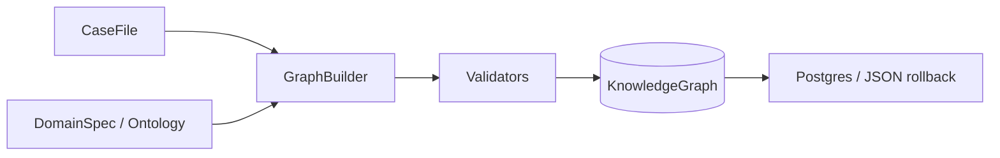
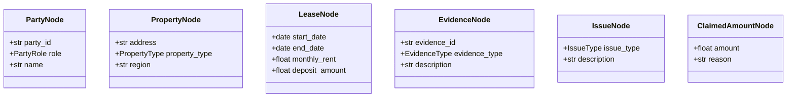

# Knowledge Graph Builder

Structured, domain-aware case representation for legal reasoning.

The graph builder is no longer deposit-only. It can stamp graphs with a `domain_id`, propagate that domain to nodes/edges, and validate against per-domain ontology rules so forum/remedy logic does not bleed between deposit, repairs, Property Chamber RRO, and employment research domains.

## Architecture


```mermaid
flowchart LR
    CaseFile[CaseFile] --> Builder[GraphBuilder]
    Domain[DomainSpec / Ontology] --> Builder
    Builder --> Validate[Validators]
    Validate --> KG[(KnowledgeGraph)]
    KG --> Store[Postgres / JSON rollback]
```

## Node Types


```mermaid
classDiagram
    class PartyNode {
        +str party_id
        +PartyRole role
        +str name
    }

    class PropertyNode {
        +str address
        +PropertyType property_type
        +str region
    }

    class LeaseNode {
        +date start_date
        +date end_date
        +float monthly_rent
        +float deposit_amount
    }

    class EvidenceNode {
        +str evidence_id
        +EvidenceType evidence_type
        +str description
    }

    class IssueNode {
        +IssueType issue_type
        +str description
    }

    class ClaimedAmountNode {
        +float amount
        +str reason
    }
```

## Edge Types

| Edge | From | To | Meaning |
|------|------|------|---------|
| `PARTY_HAS_LEASE` | Party | Lease | Party is on lease |
| `LEASE_FOR_PROPERTY` | Lease | Property | Lease covers property |
| `EVIDENCE_SUPPORTS` | Evidence | Issue | Evidence supports issue |
| `PARTY_CLAIMS` | Party | ClaimedAmount | Party makes claim |
| `CLAIM_FOR_ISSUE` | ClaimedAmount | Issue | Claim relates to issue |

## Domain Metadata

Knowledge graphs carry reproducibility fields:

| Field | Purpose |
|-------|---------|
| `domain_id` | Primary domain, e.g. `housing.deposit.v1` |
| `domain_version` | Domain semantic version |
| `domain_spec_hash` | Stable hash of the domain config used at prediction time |
| `ontology_hash` | Stable hash of the ontology used for validation |

Nodes and edges can also carry `domain_id`, `forum`, and source references. Cross-domain edges are rejected unless an ontology explicitly allows a bridge.

## Usage

```python
from kg_builder import GraphBuilder, JSONGraphStore
from llm_orchestrator.models import CaseFile

# Build graph from case file for a specific domain
builder = GraphBuilder(domain_id="housing.repairs_social.v1")
kg = builder.build(case_file)

# Validate
print(f"Consistent: {kg.is_consistent}")
print(f"Errors: {kg.validation_errors}")

# Persist through the API repository layer in normal app code.
# JSONGraphStore remains useful for local fixtures/rollback.
```

## Validators

- **TemporalValidator**: Events must be in logical order
- **EvidenceChainValidator**: Claims should have supporting evidence
- **ConsistencyValidator**: No contradictory edges

## Storage

Currently uses JSON files for persistence. Can migrate to Neo4j:

```python
# Future Neo4j integration
from kg_builder.storage import Neo4jStore
store = Neo4jStore(uri="bolt://localhost:7687")
store.save(kg)
```
