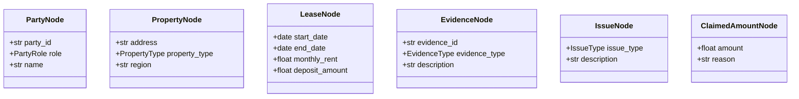

# Knowledge Graph Builder

Structured case representation for legal reasoning.

## Architecture


## Node Types



## Edge Types

| Edge | From | To | Meaning |
|------|------|------|---------|
| `PARTY_HAS_LEASE` | Party | Lease | Party is on lease |
| `LEASE_FOR_PROPERTY` | Lease | Property | Lease covers property |
| `EVIDENCE_SUPPORTS` | Evidence | Issue | Evidence supports issue |
| `PARTY_CLAIMS` | Party | ClaimedAmount | Party makes claim |
| `CLAIM_FOR_ISSUE` | ClaimedAmount | Issue | Claim relates to issue |

## Usage

```python
from kg_builder import GraphBuilder, JSONGraphStore
from llm_orchestrator.models import CaseFile

# Build graph from case file
builder = GraphBuilder()
kg = builder.build(case_file)

# Validate
print(f"Consistent: {kg.is_consistent}")
print(f"Errors: {kg.validation_errors}")

# Save
store = JSONGraphStore("./data/kg")
store.save(kg)
```

## Validators

- **TemporalValidator**: Events must be in logical order
- **EvidenceChainValidator**: Claims should have supporting evidence
- **ConsistencyValidator**: No contradictory edges

## Storage

Currently uses JSON files for persistence. Can migrate to Neo4j:

```python
# Future Neo4j integration
from kg_builder.storage import Neo4jStore
store = Neo4jStore(uri="bolt://localhost:7687")
store.save(kg)
```
