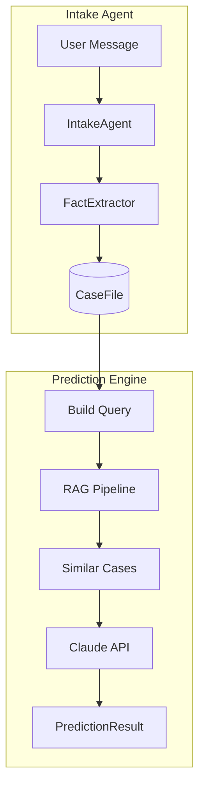
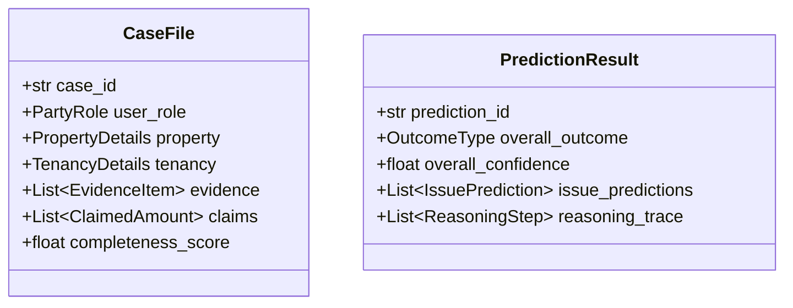
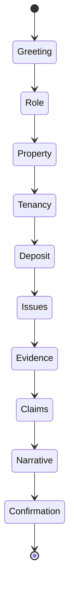

# LLM Orchestrator

Conversational intake agents and prediction engine for the legal mediation system.

## Architecture



## Components

| Component | File | Purpose |
|-----------|------|---------|
| **IntakeAgent** | `agents/intake_agent.py` | 10-stage conversational intake |
| **PredictionEngine** | `agents/prediction_agent.py` | RAG + LLM synthesis |
| **ClaudeClient** | `clients/claude_client.py` | Anthropic API wrapper |
| **FactExtractor** | `extractors/fact_extractor.py` | Extract structured facts |

## Data Models



## Intake Flow



## Usage

### CLI
```bash
python scripts/intake.py chat
```

### Python
```python
from llm_orchestrator import IntakeAgent, ClaudeClient

client = ClaudeClient(api_key="sk-ant-...")
agent = IntakeAgent(llm_client=client, role="tenant")

response = await agent.process_message("I'm disputing my deposit")
print(response.message)
print(f"Stage: {response.state.current_stage}")
```

## Configuration

```bash
export ANTHROPIC_API_KEY=sk-ant-your-key
export LLM_MODEL=claude-sonnet-4-20250514  # default
```
