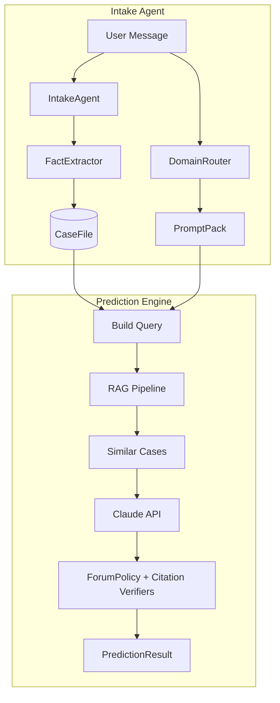
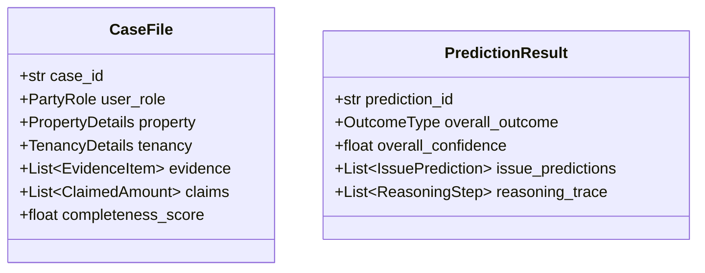
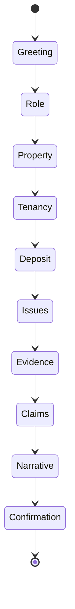

# LLM Orchestrator

Conversational intake agents, domain routing, prompt packs, and prediction engine for the legal mediation system.

The orchestrator now runs behind a domain runtime. Deposit remains the default baseline, but prompts, forum policy checks, matter labels, and prediction assembly can vary by domain without hard-coding scattered `if deposit` conditionals.

## Architecture


```mermaid
flowchart TB
    subgraph Intake["Intake Agent"]
        Chat[User Message] --> Agent[IntakeAgent]
        Chat --> Router[DomainRouter]
        Router --> Pack[PromptPack]
        Agent --> Extract[FactExtractor]
        Extract --> CaseFile[(CaseFile)]
    end

    subgraph Prediction["Prediction Engine"]
        CaseFile --> Query[Build Query]
        Pack --> Query
        Query --> RAG[RAG Pipeline]
        RAG --> Similar[Similar Cases]
        Similar --> LLM[Claude API]
        LLM --> Verify[ForumPolicy + Citation Verifiers]
        Verify --> Result[PredictionResult]
    end
```

## Components

| Component | File | Purpose |
|-----------|------|---------|
| **IntakeAgent** | `agents/intake_agent.py` | 10-stage conversational intake |
| **DomainRouter** | `domain_router.py` | Deterministic-first matter/domain routing with LLM fallback |
| **Prompt Packs** | `prompts/packs/` | Domain-specific system prompts and output framing |
| **PredictionEngineV2** | `pipeline/prediction_engine_v2.py` | RAG/KG/proposition retrieval + LLM synthesis |
| **Forum Policy Verifier** | `prompts/forum_policy_verifier.py` | Prohibited-phrase and forum/remedy checks |
| **ClaudeClient** | `clients/claude_client.py` | Anthropic API wrapper |
| **FactExtractor** | `extractors/fact_extractor.py` | Extract structured facts |

## Data Models


```mermaid
classDiagram
    class CaseFile {
        +str case_id
        +PartyRole user_role
        +PropertyDetails property
        +TenancyDetails tenancy
        +List~EvidenceItem~ evidence
        +List~ClaimedAmount~ claims
        +float completeness_score
    }

    class PredictionResult {
        +str prediction_id
        +OutcomeType overall_outcome
        +float overall_confidence
        +List~IssuePrediction~ issue_predictions
        +List~ReasoningStep~ reasoning_trace
    }
```

## Intake Flow


```mermaid
stateDiagram-v2
    [*] --> Greeting
    Greeting --> Role
    Role --> Property
    Property --> Tenancy
    Tenancy --> Deposit
    Deposit --> Issues
    Issues --> Evidence
    Evidence --> Claims
    Claims --> Narrative
    Narrative --> Confirmation
    Confirmation --> [*]
```

## Usage

### CLI
```bash
python scripts/intake.py chat
```

### Python
```python
from llm_orchestrator import IntakeAgent
from llm_orchestrator.clients.factory import get_llm_client
from llm_orchestrator.clients.types import LLMRole

client = get_llm_client(LLMRole.PREDICTION)
agent = IntakeAgent(llm_client=client, role="tenant")

response = await agent.process_message("I'm disputing my deposit")
print(response.message)
print(f"Stage: {response.state.current_stage}")
```

### Domain Routing

Routing is deterministic-first:

1. safety/out-of-scope rules
2. enabled-domain and feature-flag checks
3. high-precision keyword/rule routes
4. LLM classifier fallback only for ambiguous messages
5. confidence/margin post-checks and clarifying questions

The router is not allowed to override a disabled domain flag.

## Configuration

```bash
export ANTHROPIC_API_KEY=sk-ant-your-key
export LLM_MODEL=claude-sonnet-4-20250514  # default
```
